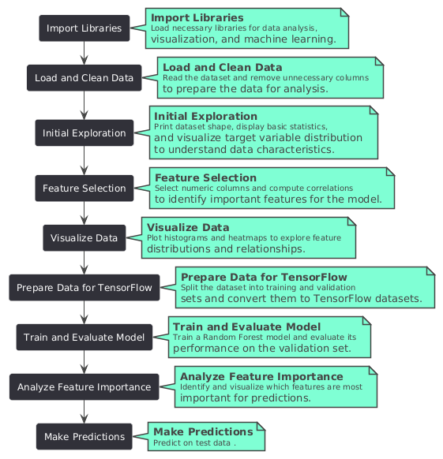

# House_Price_Prediction Project
## House Price Prediction - Kaggle Competition

This project tackles the challenge of predicting house prices in Ames, Iowa, participating in the Kaggle competition: "House Prices - Advanced Regression Techniques" ([https://www.kaggle.com/competitions/house-prices-advanced-regression-techniques](https://www.kaggle.com/competitions/house-prices-advanced-regression-techniques)).

### Why This Project?

The goal of this project is twofold:

1. **Develop Machine Learning Expertise:** By participating in this Kaggle competition, we aim to gain hands-on experience with the entire machine learning pipeline. This includes data exploration, pre-processing, feature engineering, model selection, hyperparameter tuning, evaluation, and interpretation. 
2. **House Price Prediction:**  Accurately predicting house prices is a valuable skill set in the real estate industry and financial sector. This project allows us to explore various machine learning algorithms and techniques to achieve this goal. 

### Project Gains

By completing this project, you will gain valuable experience in the following areas:

* **Data Analysis:** Learning how to explore, clean, and pre-process data for machine learning tasks.
* **Feature Engineering:** Creating new features from existing data to improve model performance.
* **Machine Learning Algorithms:** Implementing and comparing different machine learning algorithms for regression tasks. 
* **Hyperparameter Tuning:** Optimizing the performance of chosen algorithms by tuning their hyperparameters.
* **Model Evaluation:** Evaluating the performance of models using appropriate metrics and techniques like cross-validation.
* **Kaggle Competition Participation:** Getting familiar with the Kaggle platform, submitting predictions, and analyzing competition leaderboards.

This project provides a practical application of machine learning concepts, allowing you to refine your skills and build a competitive portfolio.

# Work flow

